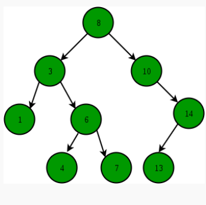
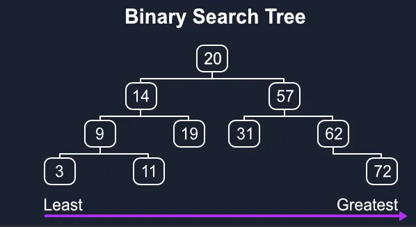

# Binary란?
Binary Search란, 결정문제의 답이 이분법적일 때 사용하는 탐색 기법


탈출 조건에 대한 고민
1) lo < hi 
2) 정답 lo or hi 
3) while 문이 끊기지 않아 시간초과

방법
1) 재귀
2) WHILE문 활용 


## 시간복잡도 
- 분할 후 정복(divide and conquer) 전략 사용 

- 평균 시간 복잡도: O(logN)

- 최악 시간 복잡도: O(logN)

- 제한 사항: 데이터가 정렬된 상태로 존재해야함 

  > [어떻게 정렬을 유지할까?](#tt)

# 발표주제 
1. 10816번을 Binary로 푸는 방법에 대해 같이 고민해요. 


    해당 문제는 백준의 단계별 문제에 이분탐색 문제로 소개되어 있으나,
저는 Dictionary를 활용해서 푸는 것이 더 효율적이라고 생각했는데 혹시 이분 탐색으로 푸는 더 효율적인 방법을 아시는분? 

2.  이 풀이는 왜 시간초과가 날까요? 한번 맞춰주세요!
``` 
def binary_search(goal, data):
    start = 0
    data.sort()
    end = len(data) - 1
    
    while start <= end:
        mid = (start + end) // 2 
        if data[mid] == goal:
            return True
        
        if data[mid] < goal:
            start = mid + 1 
        elif data[mid] > goal:
            end = mid - 1

n = int(input()) # 5를 입력 
n_num = list(map(int,input().split()))

m = int(input())
m_num = list(map(int,input().split()))

for ins_number in m_num: # ins_number 모두 넣어서 확인하기 
    if binary_search(ins_number, n_num):
        print(1)
    else:
        print(0)


```

## bisect - 배열 이진 분할 알고리즘


#2023-02-08 추가

#tt

## 정렬을 유지하는 방법 


# Binary Search Tree



### 정의




1. 어떤 노드 N을 기준으로 왼쪽 서브 트리 노드의 모든 키 값은 노드 N의 키 값보다 작아야 합니다.
2. 오른쪽 서브 트리 노드의 키 값은 노드 N의 키 값보다 커야 합니다.
3. 같은 키 값을 갖는 노드는 없습니다.


### 특징

---

1. 중위순회(좌자식,루트,우자식)시 오름차순 정렬 된 노드(key)를 얻을 수 있다.

2. 시간복잡도:

   - 탐색:O(h)

   - 삽입:O(h)

   - 삭제: O(h)

     

3. 단점: 

   1. 트리 모양에 따라 O(logN)이 아닌 O(N)이 될 수 있다.

      > root - right -right -right

### 구현 

## 이진탐색트리의 구현

```python
# 먼저 노드 클래스를 생성한다. (해당 클래스는 검색알고리즘에 필요한 기본클래스이다.)
class Node:
    def __init__(self, value): 
      self.value = value
      self.left = None #왼쪽 서브노드
      self.right = None #오른쪽 서브노드
class BinarySearchTree:
    def __init__(self, head): #BinarySearchTree 클래스 생성자
        self.head = head #부모 노드
    
    #노드 삽입 메소드
    def insert_node(self, value):
        self.base_node = self.head #연산의 기준 노드 변수 선언
        while True:
            if self.base_node.value > value: #기준 노드 값이 삽입하고자 하는 값보다 큰 경우 (삽입 값은 좌측 노드로 내려간다)
                if self.base_node.left != None: #기준 노드의 좌측 자식노드가 존재한다면
                    self.base_node = self.base_node.left #다음 연산을 위해 기준노드를 좌측 자식노드로 초기화
                else: #기준 노드의 좌측 자식노드가 존재하지 않는다면
                    self.base_node.left = Node(value) #좌측 자식노드에 값 삽입
                    break
            else: #기준 노드 값이 삽입하고자 하는 값보다 작은 경우
                if self.base_node.right != None: #기준 노드의 우측 자식노드가 존재한다면
                    self.base_node = self.base_node.right #다음 연산을 위해 기준노드를 우측 자식노드로 초기화
                else: #기준 노드의 우측 자식노드가 존재하지 않는다면
                    self.base_node.right = Node(value) #우측 자식노드에 값 삽입
                    break
	
    #노드 검색 메소드
    def search_node(self, value):
        self.base_node = self.head #연산의 기준 노드 변수 선언
        
        while self.base_node: #기준 노드가 존재하는 동안
            if self.base_node.value == value: #기준 노드의 값이 검색하고자 하는 값과 같다면
                return True #True 반환
                break
            
            elif self.base_node.value > value: #기준 노드의 값이 검색하고자 하는 값보다 클 때
                if self.base_node.left != None: #기준 노드의 좌측 자식노드가 존재한다면
                    self.base_node = self.base_node.left #다음 연산을 위해 기준 노드를 좌측 자식노드로 초기화
                else: #기준 노드의 좌측 자식노드가 없다면
                    return False #False 반환(검색하고자 하는 값이 없음)
            
            elif self.base_node.value < value: #기준 노드의 값이 검색하고자 하는 값보다 작을 때
                if self.base_node.right != None: #기준 노드의 우측 자식노드가 존재한다면
                    self.base_node = self.base_node.right #다음 연산을 위해 기준 노드를 우측 자식노드로 초기화
                else: #기준 노드의 우측 자식노드가 없다면
                    return False #False 반환(검색하고자 하는 값이 없음)
```


---

## 이진 탐색 트리를 이용한 프로그램

```java
package chap10;
import java.util.Scanner;
// 이진검색트리 클래스 BinTree<K,V>의 이용 예

class BinTreeTester {
	static Scanner stdIn = new Scanner(System.in);

	// 데이터 (회원번호 + 이름)
	static class Data {
		public static final int NO   = 1;	// 번호를 읽어 들일까요?
		public static final int NAME = 2;	// 이름을 읽어 들일까요?

		private Integer no;					// 회원번호 (키 값)
		private String  name;				// 이름

		// 키 값
		Integer keyCode() {
			return no;
		}

		// 문자열을 반환합니다.
		public String toString() {
			return name;
		}

		// 데이터를 입력합니다.
		void scanData(String guide, int sw) {
			System.out.println(guide + "할 데이터를 입력하세요.");

			if ((sw & NO) == NO) {
				System.out.print("번호：");
				no = stdIn.nextInt();
			}
			if ((sw & NAME) == NAME) {
				System.out.print("이름：");
				name = stdIn.next();
			}
		}
	}

	// 메뉴 열거형
	enum Menu {
		ADD(      "삽입"),
		REMOVE(   "삭제"),
		SEARCH(   "검색"),
		PRINT(    "출력"),
		TERMINATE("종료");

		private final String message;// 출력할 문자열 

		static Menu MenuAt(int idx) {// 서수가 idx인 열거를 반환
			for (Menu m : Menu.values())
				if (m.ordinal() == idx)
					return m;
			return null;
		}

		Menu(String string) {// 생성자
			message = string;
		}

		String getMessage() {// 출력할 문자열을 반환
			return message;
		}
	}

	// 메뉴 선택
	static Menu SelectMenu() {
		int key;
		do {
			for (Menu m : Menu.values())
				System.out.printf("(%d) %s  ", m.ordinal(), m.getMessage());
			System.out.print("：");
			key = stdIn.nextInt();
		} while (key < Menu.ADD.ordinal() || key > Menu.TERMINATE.ordinal());

		return Menu.MenuAt(key);
	}

	public static void main(String[] args) {
		Menu menu;// 메뉴
		Data data;// 추가용 데이터 참조
		Data ptr;// 검색용 데이터 참조
		Data temp = new Data();// 입력용 데이터
		BinTree<Integer, Data> tree = new BinTree<Integer, Data>();

		do {
			switch (menu = SelectMenu()) {
			 case ADD :// 노드를 삽입
					data = new Data();
			 		data.scanData("삽입", Data.NO | Data.NAME);
			 		tree.add(data.keyCode(), data);
			 		break;

			 case REMOVE :// 노드를 삭제
					temp.scanData("삭제", Data.NO);
			 		tree.remove(temp.keyCode());
			 		break;

			 case SEARCH :// 노드를 검색
					temp.scanData("검색", Data.NO);
			 		ptr = tree.search(temp.keyCode());
			 		if (ptr != null)
						System.out.println("그 번호의 이름은 " + ptr + "입니다.");
					else
			 			System.out.println("해당 데이터가 없습니다.");
			 		break;

			 case PRINT :// 모든 노드를 키 값의 오름차순으로 출력
					tree.print();
					break;
			}
		} while (menu != Menu.TERMINATE);
	}
}
```


## 결론

1. 이진 탐색은 logN의 매우 빠른 시간 복잡도를 갖는다
2. 이러한 이진 탐색 트리의 속성을 살리면서 추가와 삭제를 용이하게 한 자료구조: 이진 탐색 트리
3. 알고리즘 문제 풀이와의 연관성


## 추가할 자료

- 이진 탐색 트리의 탐색/삽입/삭제 개념
- 이진탐색트리삭제 구현

- 이진탐색 트리의 한계: 어떻게 O(logN)이 아닌 O(n) 복잡도를 갖는 트리를 극복할까?
