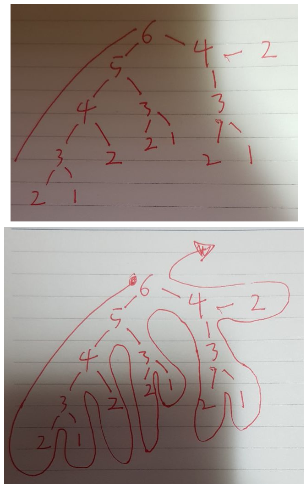
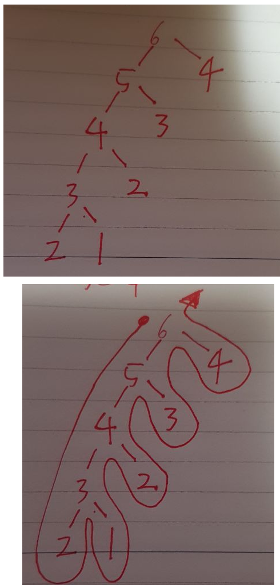

# Dynamic Programming

### 정의

---

- 점화식을 세워 문제를 푼다
  - 점화식: An = 임의의 행위(An-1)


- 결과 값을 재활용하여 한 번 한 계산을 다시 하지 않도록 함
- 대충 말하면, f(n)을 dp[n]에 저장해서 쓰는 것

### 특징

---

memoization을 이용하여 같은 계산 반복하지 않음

### 구현

---

#### dp 미사용시 fibo(6)





#### dp 사용시 fibo(6)


```python
# dp 사용 X O(n^2)
def fibo(n):
    if n==1:
        return 1
    elif n==2:
        return 1
    return fibo(n-1)+(fibo(n-2))
print('dp를 사용하지 않음',fibo(6))
# print('dp를 사용하지 않음',fibo(60))

# 상향식 방법 O(n)
def fibo1(n):
    if n==1 or n==2:
        return 1
    # dp 초기화
    dp = [0 for col in range(n+1)]
    dp[1]=1
    dp[2]=1

    for i in range(3, n+1):
        dp[i] = dp[i-1]+dp[i-2]
    return dp[n]
print('상향식',fibo1(6))
# print('상향식',fibo1(60))

# 하향식 방법
dp = [0 for col in range(101)]
def fibo2(n):
    if dp[n] != 0: #이미 구한 dp  ------ 또는 n==1 RR n==2
        return dp[n]
    else:
        if n==1 or n==2:
            return 1
        #아직 안 구한 dp memoization
        dp[n] = fibo2(n-1)+fibo2(n-2) #memoization
        return dp[n]

print('하향식',fibo2(6))
# print('하향식',fibo2(60))


#하향식 방법2
dp = [0 for col in range(101)]
def fibo22(n):
    if n==1 or n==2:
        return 1
    elif dp[n]==0:
        dp[n] = fibo22(n-1)+fibo22(n-2) #memoization
    return dp[n]
print('하향식2',fibo22(6))
# print('하향식2',fibo22(60))


```

---

### 추천 문제

- [가장 긴 증가하는 부분수열 bj_s2](https://www.acmicpc.net/problem/11053)
- [정수 삼각형 bj_s1](https://www.acmicpc.net/problem/1932)

채워나갈 리스트

- 시간 복잡도
- 추천 문제

