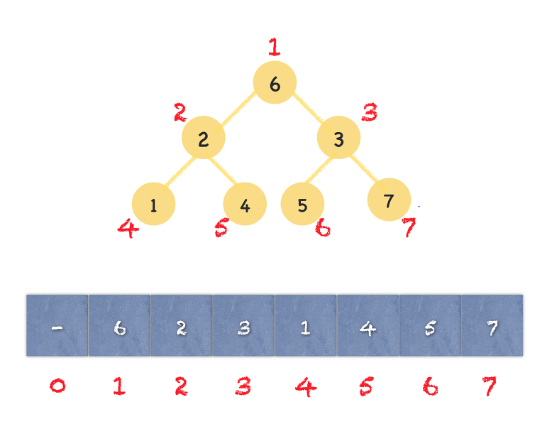
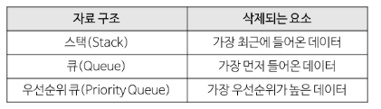
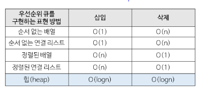
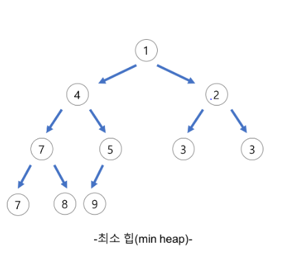
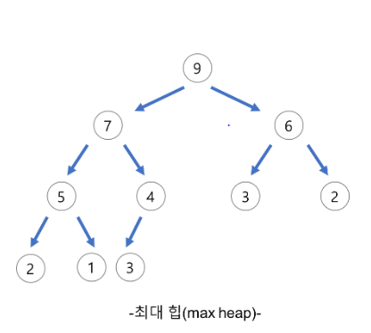

# heap에 대해서
1. 힙(Heap)이란?  
- 시간 복잡도  
- 힙 관련 문제 유형  

2. 최소 힙   
- 최소 힙에 대해서  
- 최소 힙 알고리즘  
1-1. 최소 힙 추가  
1-2. 최소 힙 삭제  

3. 최대 힙  
- 최대 힙에 대해서
- 최소 힙 알고리즘  
1-1. 최소 힙 추가  
1-2. 최소 힙 삭제

---

## 1. 힙(Heap)이란?
> 최댓값과 최솟값을 빠르게 찾기 위해 고안된 완전이진트리(Complete binary tree)를 기본으로 한 자료구조

노드 i의 부모 노드 인덱스: i//2,(단, i>1)  
노드 i의 왼쪽 자식 노드 인덱스: 2 * i 
노드 i의 오른쪽 노드 인덱스: (2 * i) + 1

1. 키 값의 대소관계는 **부모-자식 노드 사이 간에만** 성립하며 형제 노드 사이에는 영향을 미치지 않음.

### 시간 복잡도  
- O(logn)
- 우선순위 큐는, 배열, 연결리스트, 힙으로 구현이 가능. 이 중, 힙(heap)으로 구현하는 것이 가장 효율적.  

### 힙 관련 문제 유형  
- 중앙값 구하기, max_heap과 min_heap 사용
- N번째 크기의 요소 구하기
---
## 1) 최소 힙(min heap)
> 부모노드가 자식노드보다 작은 힙 

### 1. 최소 힙에 대해서 
### 1-1. 최대 힙 추가  

### 2. 최소 힙 알고리즘  
#### 2-1. 최소 힙 추가  
#### 2-2. 최소 힙 삭제
--- 
## 2) 최대 힙(max heap)
> 부모노드가 자식노드보다 큰 힙 

### 3. 최대 힙에 대해서 

## 4. 힙(Heap) 구현하기
- 최대힙 정렬 과정

- 힙 삭제후 정렬 과정

## 참고하면 좋을 사이트
- [동작 과정 애니메이션 설명](http://btv.melezinek.cz/binary-search-tree.html)